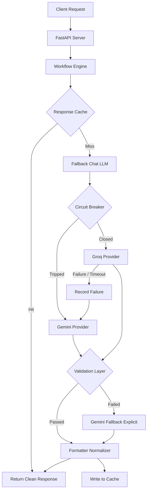

# Architecture Overview — hardered AI Orchestration

This document outlines the hardened architecture of the AI Assessment Maker orchestration backend. The architecture is designed for production-grade reliability, strict concurrency safety, local-first performance caching, and structured observability.

---

## 1. Concurrency & Thread-Safety Model

The service runs under ASGI (Uvicorn) hosting concurrent Python threads handling incoming generate/health requests. To guarantee no memory corruption, state race conditions, or deadlocks, the service uses strict, isolated single-lock scopes.

### Mutex Synchronization Points

- **Circuit Breaker (`global_groq_breaker.lock`)**: Protects the timestamp list of recent failures. The lock is only held during in-memory appends and window trims. No external APIs or block operations are called while holding the lock.
- **Provider Metrics (`global_metrics.lock`)**: Protects all global counts, timeout counters, success rates, and latency averages. Updates are in-memory increments and averages.
- **Response Cache (`global_cache.lock`)**: Protects the in-memory dictionary. Held only during reads, eager TTL evaluations, writes, and evictions.

### Deadlock Elimination

Nested locking is strictly prohibited:
- A lock is never acquired while holding another lock.
- External network requests (Groq API, Gemini HTTPX client) and JSON log parsing are executed outside of synchronized blocks.

---

## 2. Response Caching Strategy

The caching layer optimizes performance and limits provider API usage, but operates under strict production safeguards.

- **Option-driven Activation**: Toggled via `CACHE_ENABLED=true/false` in the environment configuration. If disabled, both read and write calls bypass the cache entirely and immediately return.
- **Deterministic Keys**: Cache keys are generated using SHA-256 hashes of the assessment type and trimmed prompt content:
  `SHA-256(content_type + ":" + prompt.strip())`
  Identifiers like timestamps, request IDs, and provider metadata are omitted to maximize cache hit rates.
- **Size and TTL Bounds**: Max cache size defaults to `1000` entries. Eager TTL eviction runs on every write operation, scanning for and removing expired entries before enforcing the size limit (FIFO eviction) to prevent memory leaks during prolonged uptime.
- **Safe Isolation**: Every caching operation is wrapped in a `try-except` block to ensure cache-related issues never interrupt the primary generation pipeline.

---

## 3. Observability and Lightweight Metrics

Observability is split into two lightweight, high-performance layers to ensure logging and metrics updates never degrade generation throughput.

- **Non-blocking Metrics Collection**: The `ProviderMetrics` collector processes memory-only counters and floats. It avoids file writes or database synchronization, allowing latency tracking to run in sub-microsecond timescales.
- **Structured JSON Logging**: Every lifecycle stage emits a single-line, standardized JSON log containing `request_id`, `provider`, `model`, `duration_ms`, `fallback_used`, and `validation_passed`. Log serialization is wrapped in error-handling try-blocks to avoid interrupting generation in case of stdout format or stream locks.
