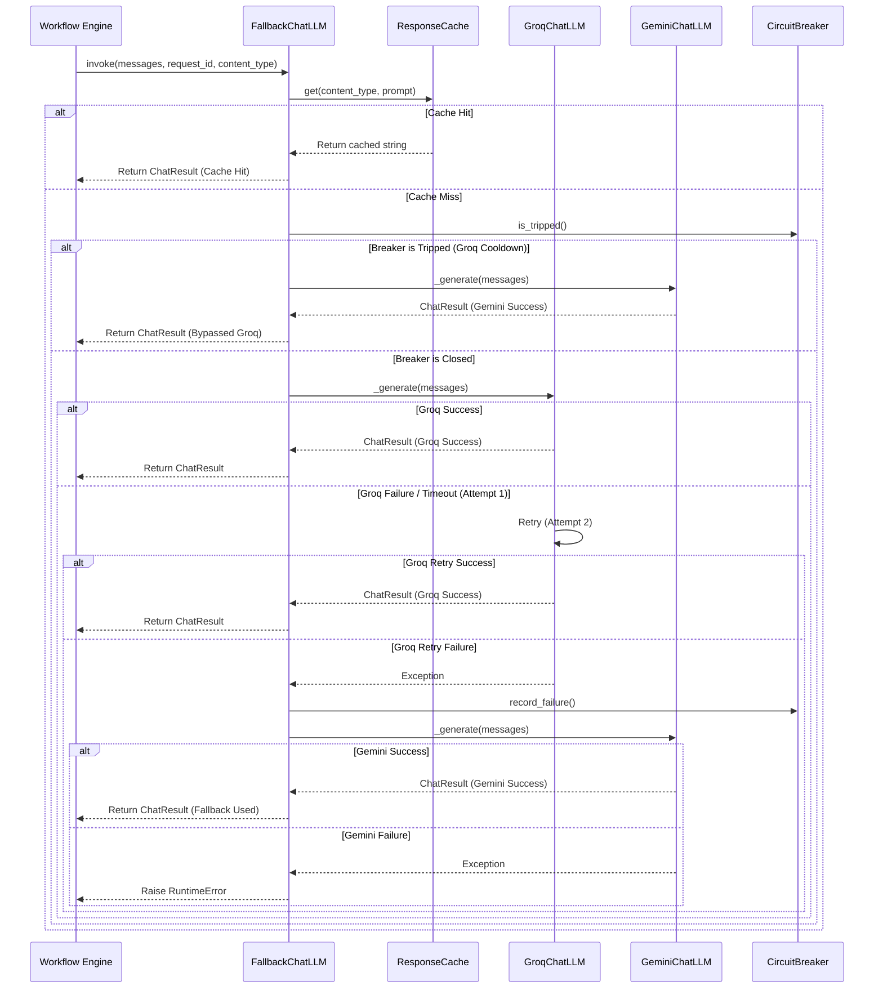

# Provider Request Lifecycle

This document describes the execution path of an AI generation request through the providers and fallback wrappers.

## 1. Lifecycle Sequence Diagram

---

## 2. Step-by-Step Flow Description

### Step 2.1: Cache Verification
The `FallbackChatLLM` checks the `ResponseCache` using the hashed prompt. If a valid entry exists within the TTL period, it immediately triggers a `cache_hit` event log and returns a mocked LangChain `ChatResult` to the engine.

### Step 2.2: Circuit Breaker Validation
Before attempting the primary provider, the wrapper queries `global_groq_breaker.is_tripped()`. If tripped:
- A circuit breaker tripped event is logged.
- The request immediately skips the primary provider and invokes the Gemini provider directly.
- The request does not block, wait, or queue, avoiding unnecessary latency.

### Step 2.3: Primary Execution (Groq)
If the circuit is closed:
- The request ID is passed down.
- Groq wrapper attempts execution.
- If it encounters an exception, it waits and retries exactly **once**.
- If the retry also fails, the exception is caught, recorded as a Groq failure (and timeout, if applicable) in metrics, and the failure timestamp is recorded in `global_groq_breaker`.

### Step 2.4: Fallback Execution (Gemini)
If Groq fails or the circuit was already tripped:
- The Gemini wrapper is invoked via direct HTTPX POST calls to Google's generative language API.
- If Gemini succeeds, it is returned, and a fallback event is recorded in metrics.
- If Gemini also fails, a `RuntimeError` is raised, indicating that both providers are exhausted.
